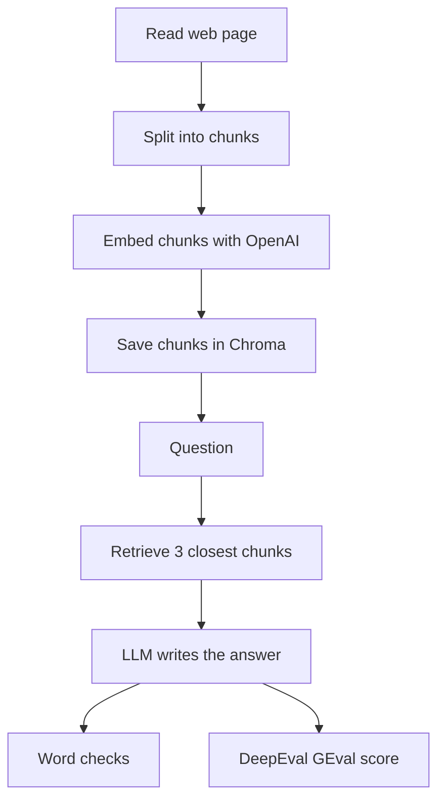

# pytest LLM eval

Pytest tests that call an LLM and score the answer with DeepEval.

## Run

```powershell
pytest --llm-mode=local
pytest --llm-mode=online
pytest pytest/test_first.py::TestRAG --llm-mode=online -s
```

`local` uses Ollama. `online` uses OpenAI. Set `LLM_MODE` in `.env` if you do not pass the flag. Add `-s` to see `print` output.

## RAG flow



## Tests

| Class | What it checks |
| --- | --- |
| `TestAnswerRelevancy` | LLM answer for "capital of France" is relevant |
| `TestRAG` | Answer about an MCP server comes from the page and passes GEval |
